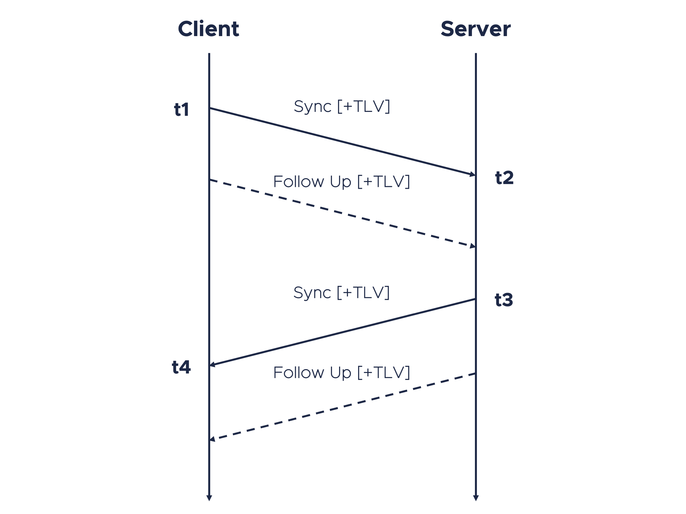

# **flashptpd**
**flashptpd** is the C++17 reference implementation for a new approach to **IEEE1588** *(Precision Time Protocol, PTP)*. Designed to improve efficiency while reducing complexity, this new approach (which for lack of a better name we call **FlashPTP** for now) modifies unicast PTP to enable it to adopt a client/server model, while maintaining—or even improving on—the achievable synchronization accuracy by combining the hardware timestamping capabilities of PTP with certain aspects of the clock filtering, selection, and combining algorithms provided by NTP.

## How it works

**Sync Request**
 
The client  sends  Sync and Follow Up Messages (assuming  that  Two-Step  mode  is  running) with a Request TLV attached  to  either  of  them.

 - **t1** - Sync Message egress  timestamp (Client)
 - **t2** - Sync Message ingress  timestamp (Server)
 

**Sync Response**
 
Upon receipt of a complete Sync Request sequence, the server responds with Sync and Follow Up Messages (again, assuming Two-Step mode) with a Response TLV attached to the same message as in the Request sequence.
 - **t3** - Sync Message egress timestamp (Server)
 - **t4** - Sync Message ingress timestamp (Client)
 

**Request TLV**
 
| Field | Octets | TLV Offset | Value |
|--|--|--|--|
| tlvType | 2 | 0 | 3 (ORG_EXT) |
| lengthField | 2 | 2 | 36+N |
| organizationId | 3 | 4 | 0xEC4670 |
| organizationSubType | 3 | 7 | 0x526571 |
| flags | 4 | 10 | ... |
| pad | 22+N | 14 | 0 |
 

**Response TLV**
 
| Field | Octets | TLV Offset | Value |
|--|--|--|--|
| tlvType | 2 | 0 | 3 (ORG_EXT) |
| lengthField | 2 | 2 | 36+N |
| organizationId | 3 | 4 | 0xEC4670 |
| organizationSubType | 3 | 7 | 0x526573 |
| flags | 4 | 10 | ... |
| error | 2 | 14 | ... |
| reqIngressTimestamp | 10 | 16 | ... |
| reqCorrectionField | 8 | 26 | ... |
| utcOffset | 2 | 34 | ... |
| serverStateDS | 0+N | 36 | ... |
 

Once a complete Sync Request / Sync Response sequence has been exchanged, mean path delay and offset can be calculated as follows:

**Mean Path Delay =** (t2 - t1 + t4 - t3) / 2
 
**Offset =** (t2 + t3 - t1 - t4) / 2
 
 

## How it's been implemented

The flashptpd project consists of a library named flashPTP and a command line utility named flashptpd using this library to run client and/or server mode of the new approach on Linux computers and (if running in client mode) to synchronize PTP hardware clocks (PHCs) and/or the system clock (CLOCK_REALTIME).
 
 

The flashPTP library provides abstract classes for the following types of algorithms:

 - **Filter** (Filtering of completed sequences)
 - **Calculation** (Calculation of offset and drift values to be used for clock adjustment)
 - **Selection** (Selection of servers to be used for clock adjustment)
 - **Adjustment** (Adjustment of specified clocks (PHCs or system clock)
 

The following implementations are currently included:

**Filters:**

 1. **Lucky Packet Filter** - Select a configurable amount of sequences with the lowest measured path delay (lucky packets) out of an also configurable amount of completed sequences. This helps select for those packets which had the least interference through the network.
 2. **Median Offset Filter** - Select a configurable amount of sequences with the median measured offset. Especially in combination with the lucky packet filter (select one median offset out of n lucky packets), the algorithm can help to reduce noise (i.e., timestamping errors).

**Calculations:**

 1. **Pass-Through** - Very simple pass-through of completed Sync Request / Sync Response sequences. As soon as a sequence has been completed and inserted, the measured offset and drift can be used by an adjustment algorithm to perform a clock adjustment. This "algorithm" should only be used for very good connections (i.e., full path PTP support).
 2. **Arithmetic Mean** - As soon as the configured amount of Sync Request / Sync Response sequences have been completed, the algorithm calculates the arithmetic mean of all measured delay, offset and drift values. This allows to have kind of a sliding window of measurements and helps to reduce measurement errors. The sample rate and window duration depends on the request interval and possibly used filter algorithms.

**Selections:**

 1. **BTCA** - Best TimeTransmitter Clock Algorithm as defined in IEEE1588. Servers that shall be taken into consideration by this algorithm need to request the FlashPTPServerStateDS in the Sync Request TLV. You need to explicitely configure "stateInterval" for each server. The algorithm will then select the configured amount of servers with the best PTP quality parameters. As of now, the BTCA quality parameters in flashptpd server mode can only be specified via configuration. Therefore, the outcome of the BTCA selection algorithm is kind of predefined and it does not really make sense to use it.
 2. **Standard Deviation** - Selects the configured amount of servers with the best (lowest) standard deviation in the measured offsets.

**Adjustments:**

 1. **Adjtimex** - Pretty straight forward adjustment of the system clock (CLOCK_REALTIME) using the standard Linux API function adjtimex.
 2. **PID Controller** - Configurable PID controller. Unlike many other PID controller implementations, this one applies an integral adjustment part by keeping a small part of the previous adjustment when performing a new adjustment with a proportional and (optional) differential part. Ratios of all parts (iRatio, pRatio, dRatio) as well as a step threshold in nanoseconds can be configured, individually.
 

## Contributing to flashptpd

The above list of included algorithm implementations could easily be extended by deriving from the appropriate abstract class and following the instructions included in the file comments. **Please feel free to do so and to contribute to this project.** The preferred way is to [fork](https://docs.github.com/de/get-started/quickstart/fork-a-repo) flashptpd, checkout the correct branch, code, and [send a pull request](https://help.github.com/articles/using-pull-requests/) from your fork's branch to our repository branch.
 
 

## License
flashptpd is licensed under the MIT License:
 

Copyright 2023, Meinberg Funkuhren GmbH & Co. KG, All rights reserved.
 
Author: Thomas Behn <thomas.behn@meinberg.de>
 

Permission is hereby granted, free of charge, to any person obtaining a copy of this software and associated documentation files (the “Software”), to deal in the Software without restriction, including without limitation the rights to use, copy, modify, merge, publish, distribute, sublicense, and/or sell copies of the Software, and to permit persons to whom the Software is furnished to do so, subject to the following conditions:
 

The above copyright notice and this permission notice shall be included in all copies or substantial portions of the Software.
 

THE SOFTWARE IS PROVIDED “AS IS”, WITHOUT WARRANTY OF ANY KIND, EXPRESS OR IMPLIED, INCLUDING BUT NOT LIMITED TO THE WARRANTIES OF MERCHANTABILITY, FITNESS FOR A PARTICULAR PURPOSE AND NONINFRINGEMENT. IN NO EVENT SHALL THE AUTHORS OR COPYRIGHT HOLDERS BE LIABLE FOR ANY CLAIM, DAMAGES OR OTHER LIABILITY, WHETHER IN AN ACTION OF CONTRACT, TORT OR OTHERWISE, ARISING FROM, OUT OF OR IN CONNECTION WITH THE SOFTWARE OR THE USE OR OTHER DEALINGS IN THE SOFTWARE.
